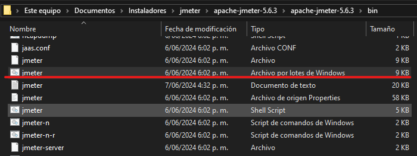
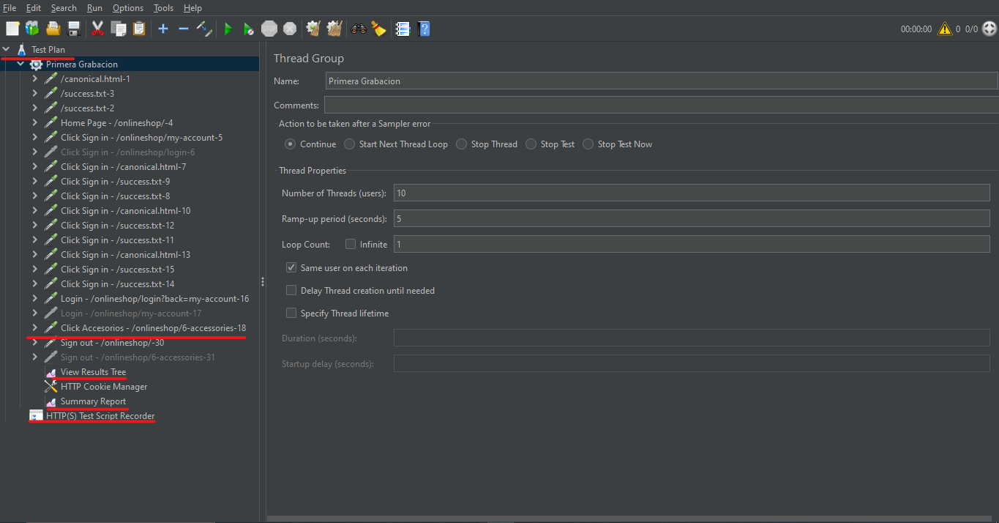

# Sesion 1: Configuracion JMETER 

## Objetivo: 

        - Configurar la herramienta JMETER para la ejecucion de pruebas de rendimiento. 

## Elaboracion de la practica: 

        - Ingresar a JMETER a traves de la URL https://jmeter.apache.org/ y descargar la aplicacion. 

        - Verificar la version de Java instalado. En caso de no tener una version mayor o igual al JDK 1.8 descargarlo y configurarlo dentro de las variables de entorno como JAVA_HOME. 

        - Seleccionar una ruta de descarga del proyecto y descomprimirlo 

        - Ingresar a la ruta ..\apache-jmeter-5.6.3\apache-jmeter-5.6.3\bin y ejecutar el archivo jmeter.bat 

        - Explore el entorno de trabajo de jmeter. 

        1. Test Plan: Contiene todos los casos de prueba definidos y sus componentes requeridos.
        2. Thread Group: Define las caracteristicas del numero de hilos que lanzara una prueba. Se puede asociar como el numero de actores que ejecutan las casos de pruebas de manera secuencial en un periodo de tiempo. 
        3. View Results Tree: Muestra los resultados al ejecutar los casos de prueba. 
        4. Summary Report: Genera las estadisticas generadas al finalizar los casos de prueba. 

